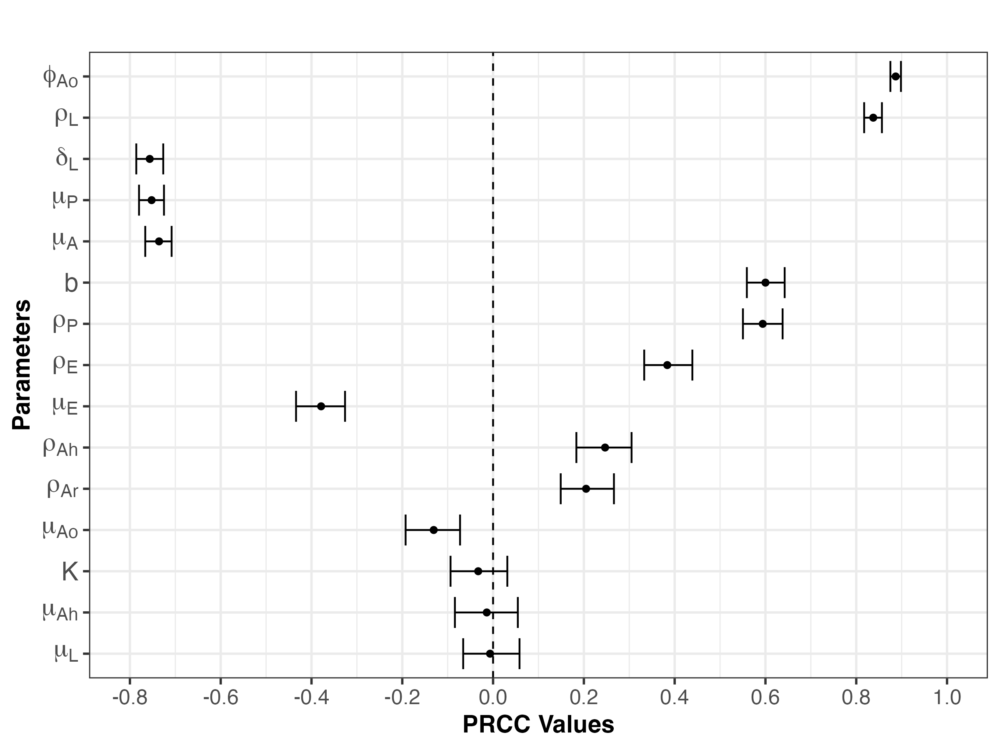

# Sensitivity Analysis for Climate-Driven Mosquito Population Model

This repository contains the code, figures, and results for the global sensitivity analysis of a climate-driven mosquito population dynamics model. The analysis identifies key parameters influencing model outputs using Latin Hypercube Sampling (LHS) and Partial Rank Correlation Coefficients (PRCC).

## Overview

The sensitivity analysis assesses how variations in life history and climate-dependent parameters affect adult mosquito abundance. The approach combines:
- Parameter sampling using Latin Hypercube Sampling (LHS)
- Model evaluation across sampled parameter sets
- Output summarization using PRCC with confidence intervals

## Features

- Full sensitivity pipeline using `lhs` and `sensitivity` packages
- Support for both deterministic and stochastic model runs
- Bootstrapped PRCC calculation with 95% confidence intervals
- Plots showing parameter influence, ranked by effect size

## Repository Structure

```r
sensitivity-analysis/
├── code/ # R scripts and R Markdown files for analysis
├── figures/ # PRCC plots, parameter ranking visuals, CIs
└── README.md # Project overview and instructions
```


## Tools & Packages

- R (`lhs`, `sensitivity`, `boot`, `ggplot2`, `dplyr`, `deSolve`)
- Parameter ranking using PRCC
- Visualization using `ggplot2` and `patchwork`

## How to Run

To reproduce the full sensitivity analysis:

```r
rmarkdown::render("code/sensitivity_analysis_summary.Rmd")
```

## 📊 Example Output

